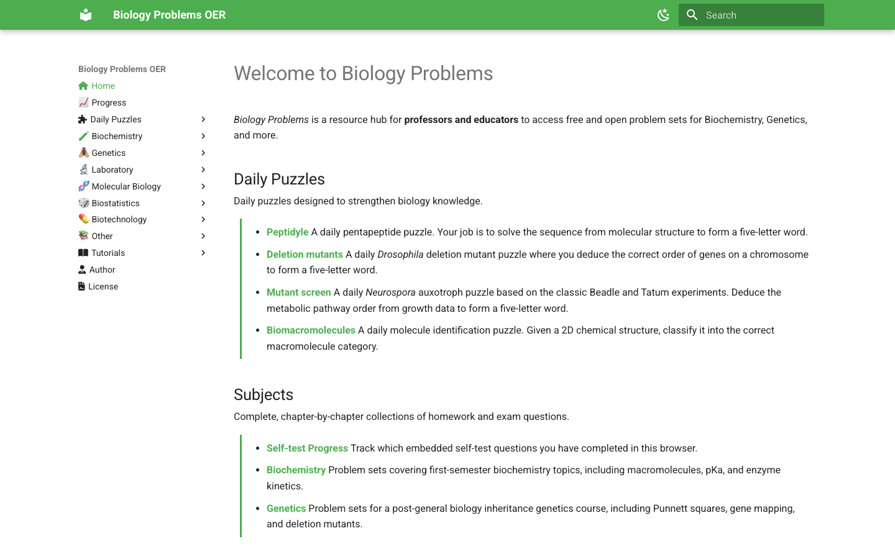
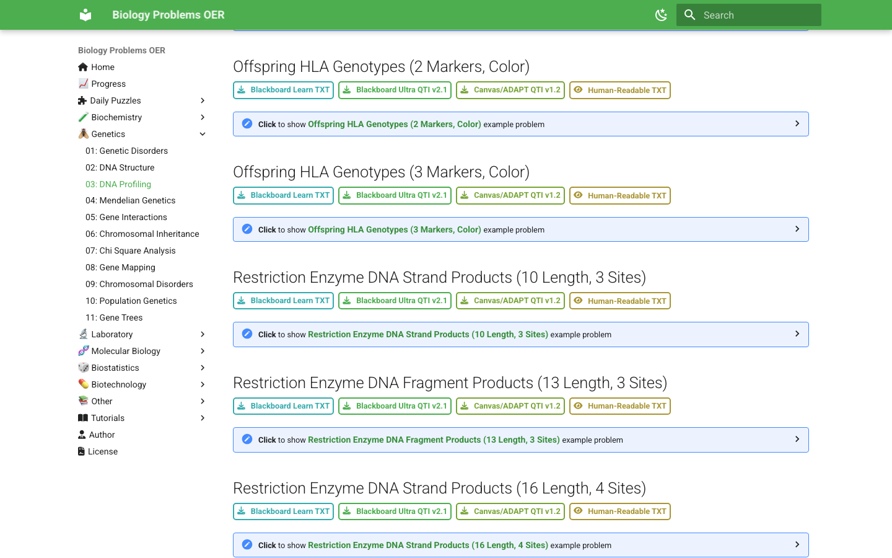
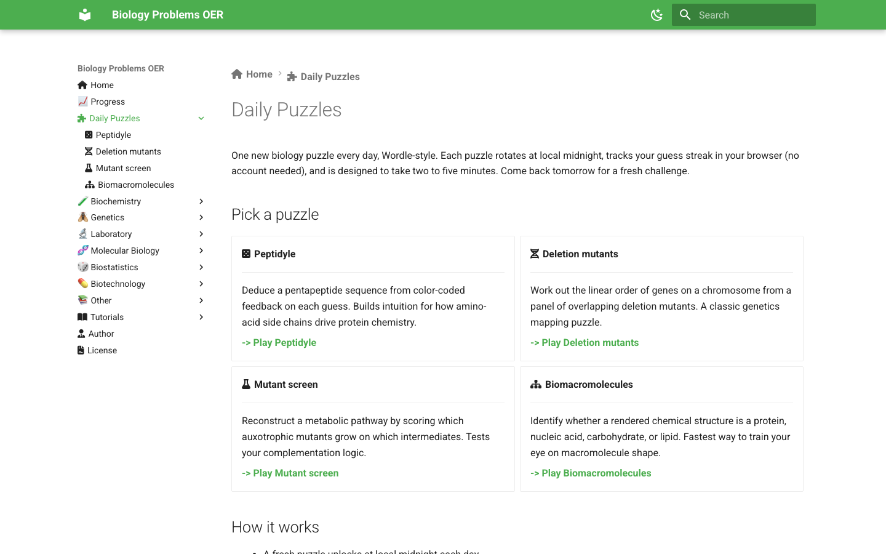

# Biology Problems OER

Free, open biology problem sets that help students practice and give educators ready-to-use questions for courses, homework, quizzes, and learning-management systems.

**Explore the live collection: [biologyproblems.org](https://biologyproblems.org/)**

Browse chapter-by-chapter collections in biochemistry, genetics, molecular biology,
laboratory methods, biostatistics, biotechnology, and cell biology. Try interactive
self-tests, return for a daily puzzle, or download question banks for Blackboard,
Canvas, ADAPT, and other teaching workflows.

## See what is inside

<!-- screenshots:begin (managed by screenshot-docs) -->



<!-- screenshots:end -->

## Why use it?

- Practice with interactive example questions and browser-local progress tracking.
- Explore daily puzzles for peptide chemistry, genetics, metabolism, and macromolecules.
- Download editable or import-ready question sets in Blackboard TXT, Blackboard QTI,
  Canvas/ADAPT QTI, and human-readable formats.
- Find distinct variants for difficulty, question format, dataset size, and course scope.
- Reuse openly licensed material in teaching and study workflows.

## Start exploring

Visit [biologyproblems.org](https://biologyproblems.org/) and choose a subject from the
navigation. Good starting points include the [daily puzzles](https://biologyproblems.org/daily_puzzles/),
[biochemistry](https://biologyproblems.org/biochemistry/), and
[genetics](https://biologyproblems.org/genetics/) collections.

To preview the site locally:

```bash
python3.12 -m pip install -r pip_requirements.txt
mkdocs serve
```

Open `http://127.0.0.1:8000/`. See [docs/INSTALL.md](docs/INSTALL.md) for setup and
[docs/USAGE.md](docs/USAGE.md) for generation and testing workflows.

## Documentation

- [docs/INSTALL.md](docs/INSTALL.md): Local setup and verification.
- [docs/USAGE.md](docs/USAGE.md): Site, generator, and screenshot commands.
- [docs/CODE_ARCHITECTURE.md](docs/CODE_ARCHITECTURE.md): Components and data flow.
- [docs/FILE_STRUCTURE.md](docs/FILE_STRUCTURE.md): Repository and generated-file map.
- [docs/RELATED_PROJECTS.md](docs/RELATED_PROJECTS.md): Connected generators and tooling.
- [docs/NEWS.md](docs/NEWS.md): Curated project highlights.
- [docs/CHANGELOG.md](docs/CHANGELOG.md): Detailed chronological changes.
