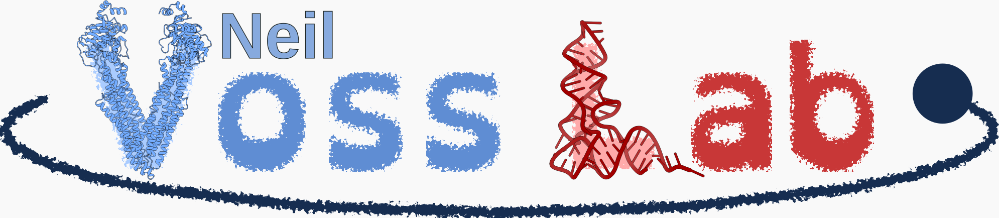

# About the Author

{: style="width: 150px; border-radius: 50%;"}

Dr. Neil R. Voss is an Associate Professor of Biology at Roosevelt University, where he has been dedicated to teaching and mentoring students since 2010. With a Ph.D. in Molecular Biophysics and Biochemistry, as well as B.S. degrees in both Mathematics and Physics, Dr. Voss also has extensive experience in computer programming and software development. He specializes in Python programming and has applied his computational expertise to problem set development shared on this website.

## Research & Computational Work

In addition to his teaching and OER development, Dr. Voss has worked extensively in computational biology, structural biophysics, and molecular visualization. His past research contributions include CryoEM data processing, protein geometry analysis, and molecular modeling software development. Outside of academia, he is a Lego artist and a member of the [Northern Illinois Lego Train Club (NILTC)](https://www.niltc.org).

## Open Educational Resources (OER)

As a strong advocate for Open Educational Resources (OER), Dr. Voss is committed to expanding access to high-quality, no-cost educational materials. Having taught courses in biochemistry, genetics, molecular biology, and biostatistics, he has developed computational tools to enhance problem-based learning by creating dynamic, sharing-resistant problem sets.

This website was funded by an Illinois State Library OER Grant, titled *"Dynamic and Sharing-Resistant OER Problem Sets for Biochemistry and Genetics" (2024–2026).* These problem sets ensure fair and effective assessments for online learning environments. The grant also supports projects that focus on LibreTexts ADAPT integration, QTI format standardization, and faculty outreach to promote OER adoption.

## Social Media Links

- [YouTube](https://www.youtube.com/neilvosslab)
- [GitHub](https://github.com/vosslab)
- [Bluesky](https://bsky.app/profile/neilvosslab.bsky.social)
- [Facebook](https://fb.me/neilvosslab)
- [LinkedIn](https://www.linkedin.com/in/vosslab)

## Support This Project

Dr. Voss's work in OER development is driven by a passion for accessible and high-quality STEM education. If you’d like to support the continued creation of free and open problem sets, or drive any specicl questions or features, consider contributing:

- Bitcoin: [Donate with Bitcoin](bitcoin:bc1qdexkqwzyet93ret40akqmms2jv99wvsgzdshu8?message=support%20qti_package_maker)
- Dash: [Donate with Dash](dash:XdDmwBVecEy9yyXKeD7hScLp7oN8rd4XNV?message=support%20qti_package_maker)
- Patreon: [Support on Patreon](https://www.patreon.com/vosslab)
- PayPal: [Donate via PayPal](https://paypal.me/vosslab)
