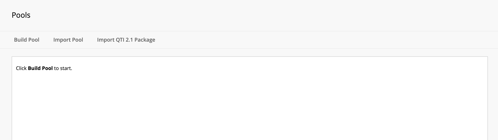
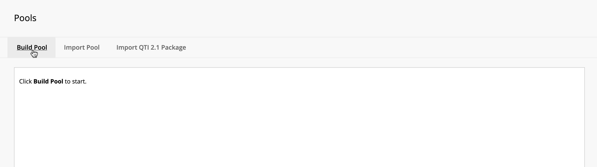
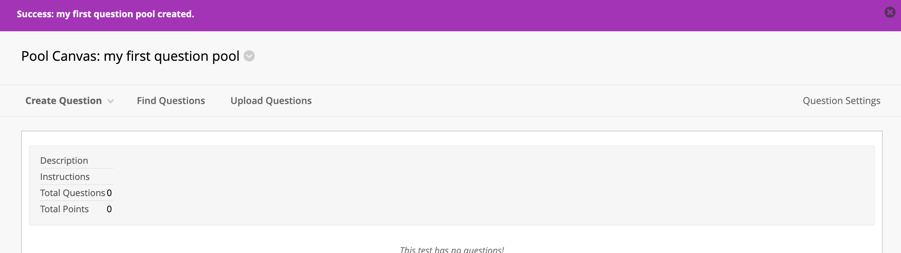
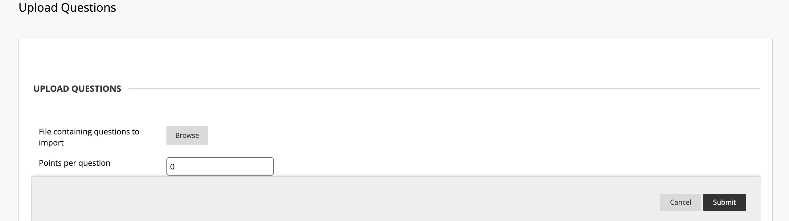
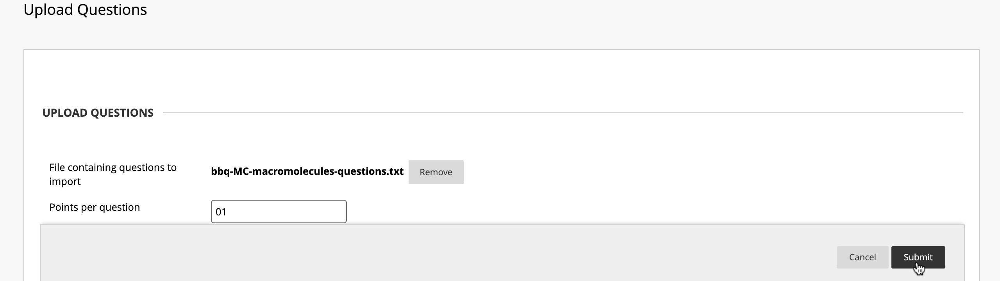
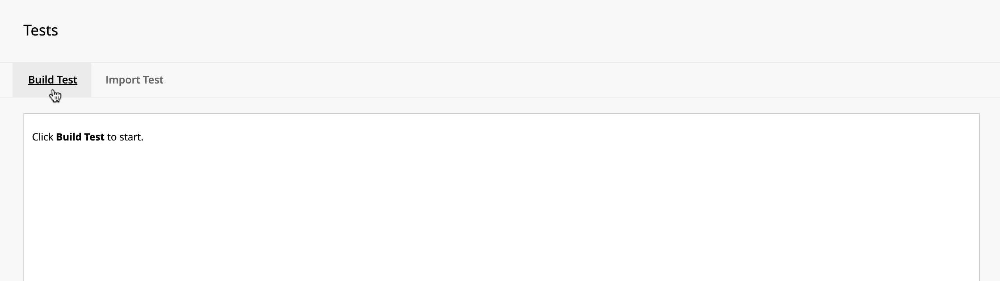
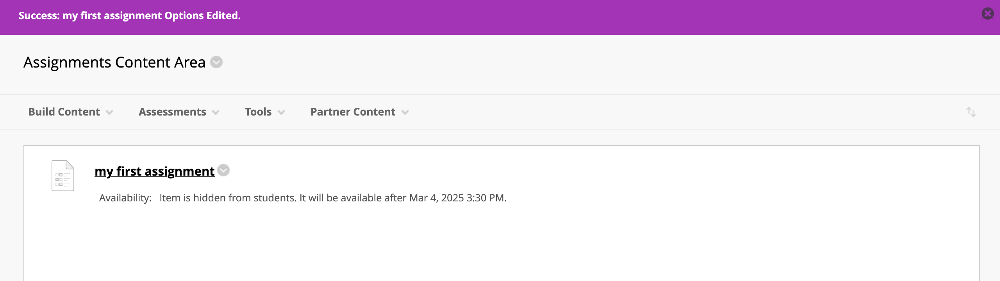

# **Tutorial: Creating a Randomized Test in Blackboard**

## **Introduction**
Creating a randomized test in Blackboard ensures that each student receives a unique question set, enhancing test security and fairness. This tutorial will guide you through the process of setting up a test using question pools and random blocks.

---

## **Part 1: Build an Empty Pool**
In this part, we will create an empty question pool to store the test questions we plan to upload. A **question pool** in Blackboard serves as a collection of reusable questions that can be pulled into quizzes, tests, or exams.

**Steps:**
1. Navigate to the **Test, Pools, and Surveys** section.
2. Click on **Pools**.
   

3. Here is the **main Pools menu** where all created pools will be listed. Since we haven't created any yet, the list is empty.
   

4. Click on **Build Pool** to start creating a new pool.
   

5. This is the **Pool Information Page**, where we enter details for our new pool.
   

6. Enter a **Pool Name** (e.g., "My First Question Pool") and click **Submit** to save it.
   

7. The **Pool has been successfully created!** You will now see a confirmation banner.
   

---

## **Part 2: Import the BBQ Text Questions**
Now that we have a **question pool**, we need to populate it with questions. Instead of adding them manually, we will **upload a batch of questions** using a preformatted BBQ text file.

**Steps:**
1. While inside the **Pool** information page, click **Upload Questions** from the menu.
   

2. This is the **Upload Questions** screen. Here, we will select the BBQ text file containing the questions. Click **Browse Local Files** to locate the file on your computer.
   

3. After selecting the file, enter a point value for the questions, and click **Submit** to upload it.
   

4. If the upload is successful, you will see a **confirmation message**.
   

5. Scroll down and you can see the list of imported questions. You can review them to ensure they were uploaded correctly.
   

---

## **Part 3: Build an Empty Test "Assignment"**
Now that we have a **question pool** filled with questions, we need to create a test that students will take. This test, also referred to as an **assignment**, will be set up in Blackboard and later linked to the pool of questions.

**Steps:**

1. Navigate to the **Tests** section in Blackboard by selecting **Tests, Surveys, and Pools**, then clicking **Tests**.
   

2. This is the **Tests** menu. Since no tests exist yet, we need to create a new one. Click **Build Test**.
   

3. In the dropdown, click **Build Test** to start creating the test.
   

4. This is the **Test Information** page. Here, enter a **test name**, an optional **description**, and any **instructions** for students.
   

5. Once you've entered the test details, click **Submit** to save your test.
   

6. You will see a **confirmation message** indicating that your test has been successfully created.
   

At this point, we have successfully **built an empty test**. In the next step, we will add **randomized questions from the question pool** to ensure each student gets a unique set of questions.

---

## **Part 4: Add a Random Block to the Assignment of the Pooled Questions**
Random blocks pull a set number of questions from a pool to ensure variation. This ensures each student gets a different combination of questions, making tests fairer and reducing the likelihood of answer sharing.

**Steps:**

1. On the **Test Information** page, click **Reuse Question > Create Random Block**. This allows you to pull a set of randomized questions from the pool.

   

2. A pop-up window will appear, asking you to select the **question pool**. Choose the question pool you created earlier.

   

3. Select **All Pool Questions** to ensure that Blackboard pulls from the full list of available questions.

   

4. Once selected, the question block area will display the questions from your pool.

   

5. Verify that the correct questions have been added to the test. Click **Submit** to finalize the random block settings.

   

6. After submitting, you will see a **success message**. The test now contains a **randomized question block**, meaning every student will receive a unique set of questions each time they take the test.

   

7. At this point, you can specify the **number of questions** to be pulled from the pool for each student and adjust the **point value** for each question.

   

In the next step, we will make the test available to students and configure additional test settings.

---

## **Part 5: Make the Assignment Available to Students**

### **Sub Part 5a: Add the Test to the Course**

Now that the test is created and contains a randomized question block, we need to make it available to students by adding it to the **Assignments Content Area**.

**Steps:**

1. Navigate to the **Assignments Content Area** where students will access the test.

   

2. Click on **Assessments**, then select **Test** from the dropdown menu.

   

3. The **Add Test** menu will appear. Select the test you created earlier (e.g., "My First Assignment").

   

4. Click **Submit** to attach the test to the course.

   

At this stage, the test is now linked to the **Assignments Content Area**, but we still need to configure additional settings to control availability and access for students.

---

### **Sub Part 5b: Customize Test Settings**
Now that the test has been added to the course, we must configure its settings in the **Test Options** menu. These settings determine how and when students can access the test.

**Steps:**

1. Select **Yes** to make the test available to students.

   

2. If you want students to have multiple attempts, choose an **attempt limit** and select a scoring method (e.g., highest grade).

   

3. If you want to set a time limit, check **Set Timer**, enter the duration, and enable **Auto-Submit** if desired.

   

4. Define the **Due Date** for the test and select the option to prevent students from starting the test after the deadline.

   

5. Choose **feedback settings**, such as displaying scores, submitted answers, and incorrect responses after test completion.

   

6. In the **Test Presentation** section, choose whether to display questions **one at a time** and enable **randomized question order** for additional security.

   

---

### **Sub Part 5c: Success!**
After configuring the settings, click **Submit** to finalize the test setup. You will see a confirmation screen indicating that the test is now available to students.

   

---

## **Conclusion**
Congratulations! Your test is now fully set up and available for students. You have successfully:
- Created a **question pool**
- Uploaded **BBQ text questions**
- Built a **randomized test**
- Configured **test settings and availability**

Your students can now access and complete the test within Blackboard. Great job!

