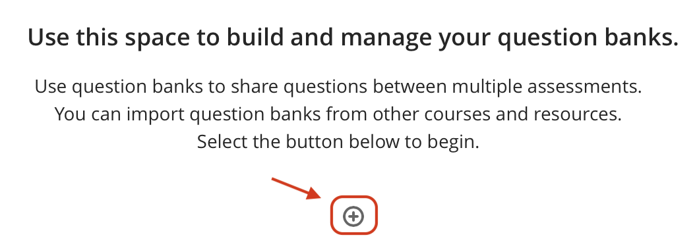
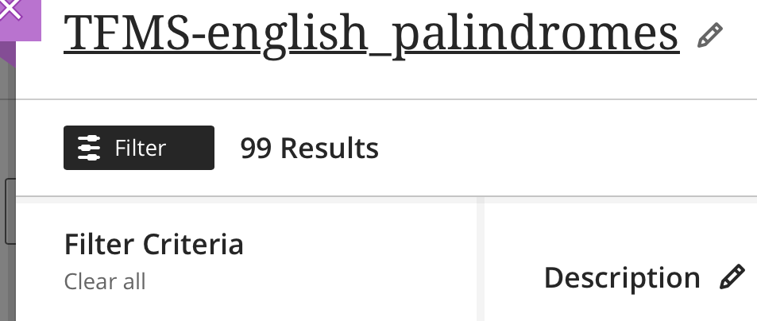
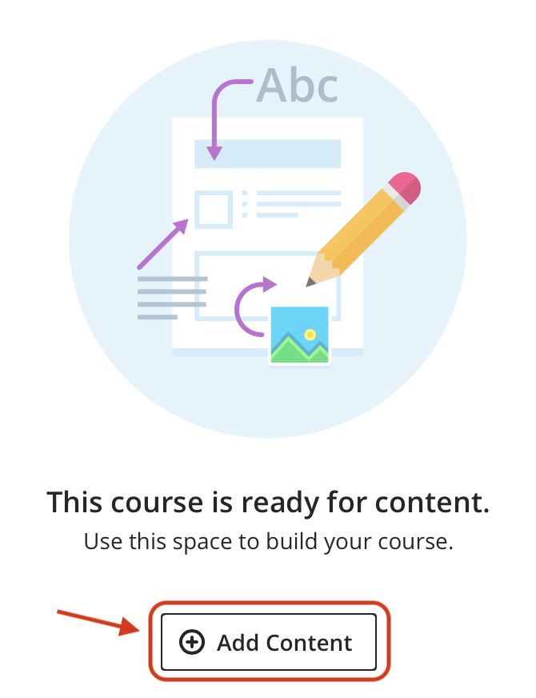
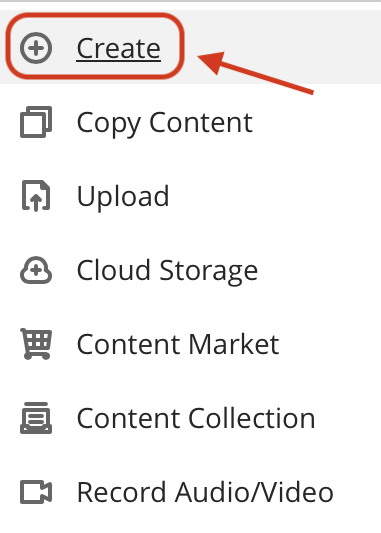
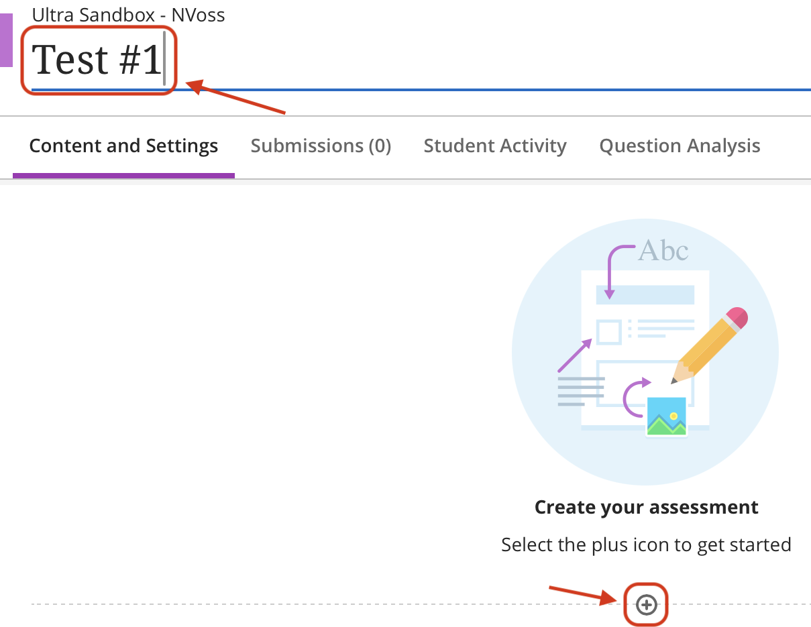
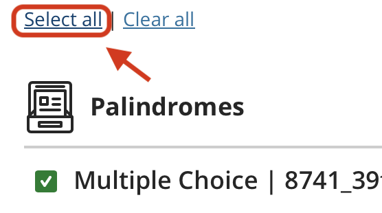
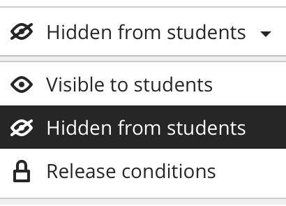

# **Tutorial: Creating a Randomized Test in Blackboard Ultra**

## **Introduction**
In this guide, we will create a question bank and then build a test from it.  
Blackboard Ultra will automatically randomize the questions, so each student receives a different version of the quiz.

---

## **Part 1: Upload Questions**
In this section, we will upload the questions into Blackboard Ultra using QTI .zip files.  
The QTI format makes it simple to transfer questions and prepare them for use in Blackboard Ultra quizzes.

**Steps:**

1. **Navigate to content:** In your course, use the menu on the left and make sure you are in the **Content** section. If not, click on **Content** to open it.  
{ width=40% }

2. **Go to Manage banks:** On the right-hand side of the page, in the **Details & Actions** panel, find the **Question Banks** section. Click on **Manage banks**.  
{ width=40% }

3. **Click on "PLUS" symbol:** In the middle of the page, click the **plus (+)** symbol. If you already have question banks, the plus symbol will appear above the existing banks.  
{ width=60% }

4. After clicking the **plus (+)** symbol, a dropdown menu will appear. Select **Import from QTI 2.1 package**.  
{ width=60% }

5. After uploading the .zip file, the new question bank will appear in the list. Click on it to change the name to something more descriptive, so you can easily identify it later.  
{ width=60% }

6. Click on the title of the question bank to rename it. You can also add a description if you want to provide more context.  
{ width=60% }

---

## **Part 2 : Creating a Quiz from the Question Bank**
Now that the questions have been uploaded into Blackboard Ultra, we can create a quiz that draws from the question bank.  The quiz will use a set number of questions and automatically randomize them for each student.

**Steps:**

1. **Navigate to Content:** Return to the main **Content** page by closing the previously opened panels or pages.  
{ width=40% }

2. In the middle of the page, click **Add Content**. If you already have content on this page, you will see a **plus (+)** symbol above or below the existing content instead.  
{ width=40% }

3. A dropdown menu will appear. Click on the first option at the top, **Create**.  
{ width=40% }

4. A panel will appear on the right side of the screen. Under **Assessment**, click on **Test**.  
{ width=40% }

5. A new page will open. In the top-left corner, enter a name for your quiz. Then, in the middle of the page, click the **plus (+)** symbol to add content.  
{ width=40% }

6. After clicking the **plus (+)** symbol, a dropdown menu will appear. Click on the first option, **Add Question Pool**.  
{ width=40% }

7. A new page will open. On the left side, under **Sources**, select the question bank you uploaded. If this is your only uploaded resource, you can skip this step.  
{ width=40% }

8. At the top of your question bank, click **Select All** to include every question. If you only want to use some of the questions, select them individually instead.  
{ width=40% }

9. After choosing the questions you want to include, go to the bottom-right corner of the page and click **Add Questions**.  
{ width=60% }

10. Choose the number of questions you want students to answer and set the points for each question. Blackboard will automatically randomize which questions are shown. When you are finished, click **Save**.  
{ width=90% }

11. Now that your questions are ready, you can edit the assessment settings just as you would for any other test. Set options such as the due date, time limit, availability, and other preferences.  
{ width=40% }

12. In the top-right corner, click the **Hidden from students** dropdown. A menu will appear. If you set up **release conditions**, choose this option. Otherwise, select **Visible to students** to publish the quiz.  
{ width=40% }

---

## **Conclusion**
Congratulations! Your test is now fully set up and available for students. You have successfully:  
  
- Uploaded the questions  
- Renamed your question bank    
- Configured a test using that bank

Your students can now access and complete the test within Blackboard Ultra. Great job!