# **Tutorial: Creating a Randomized Test in Canvas**

## **Introduction**
Creating a randomized quiz in Canvas allows you to pull unique question sets for each student, enhancing both test security and fairness. This tutorial will guide you through the process of setting up a Question Bank and creating a Question Group to randomize questions for your quiz.

---

## **Part 1: Upload Questions**
In this section, we will upload the questions to Canvas using QTI .zip files. This format allows you to easily transfer the questions into Canvas and get them ready for use in quizzes.

**Steps:**

1. **Navigate to Settings:** On the bottom left-hand side of your course, click on **Settings**.
{ width=40% }

1. **Go to Import Course Content:** On the right-hand side, in the middle of the page, click on **Import Course Content.**
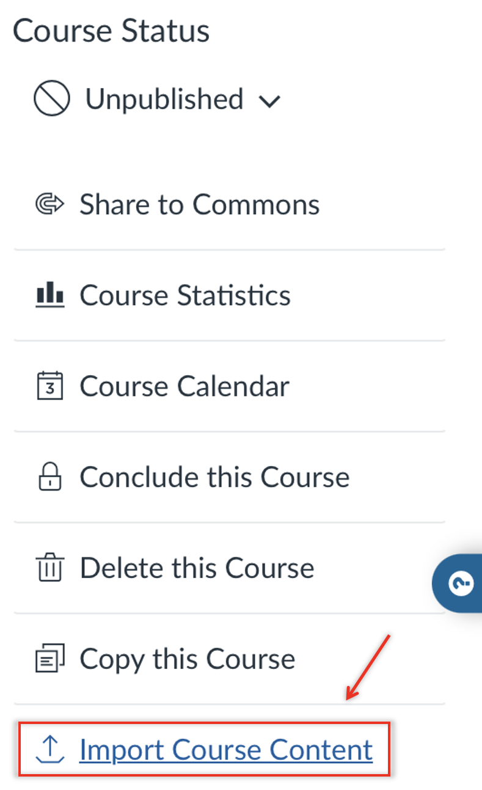{ width=40% }

1. **Select Content Type:** Under **"Select Content Type"**, open the drop-down menu and choose **"QTI .zip file"** at the bottom of the list.
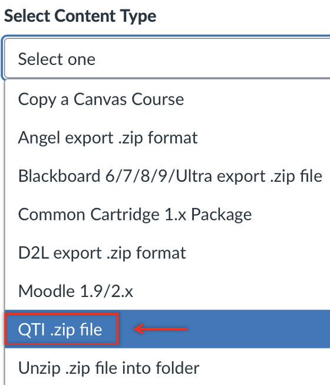{ width=40% }

1. Under **Source**, click **Choose File** to select the QTI .zip file, then upload the specific file containing the questions you want to add.
{ width=60% }

1. After uploading the file, scroll down and click **+ Add to Import Queue**.
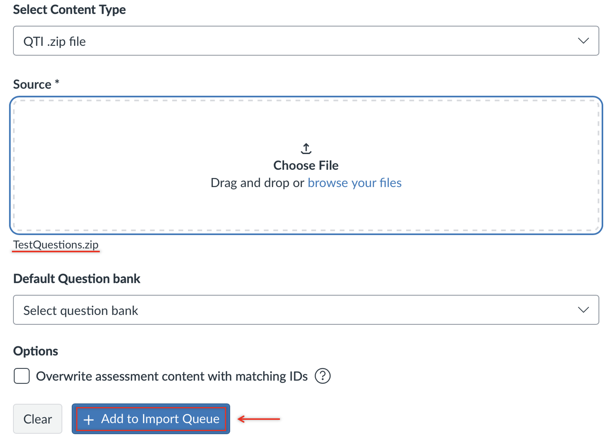{ width=60% }

1. Wait a moment until the file upload shows **"Completed"** in green.
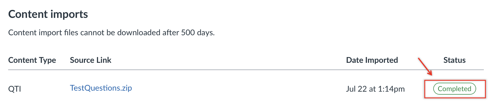{ width=90% }

---

## **Part 2 (Optional): Rename your Question Bank**
Now that we have uploaded the questions to Canvas, we can rename the file to make it easier to identify the question bank when setting up the randomization process.

**Steps:**

1. **Navigate to Quizzes:** On the middle left-hand side of your course, click on **Quizzes**.
{ width=45% }

2. **In the top-right corner**, click the three dots next to the **+ Quiz button**. A drop-down menu will appear. Then, click on **Manage Question Banks**.
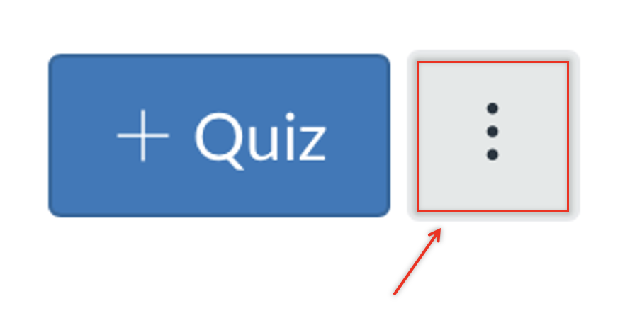{ .img-right-pad width=53.9% }
{ width=40% }

3. You will see a list of the uploaded .zip files containing the questions for this course. To rename a questions bank, click the **pencil icon** to the right of the name, enter your desired name, and press **Enter**.
{ width=100% }
{ width=100% }

---

## **Part 3: Creating a Randomized Quiz Using Your Question Bank**
In this section, we will create a quiz and set up a randomized question group that can be reused in the future.

1. As before, on the middle left-hand side of your course, click on **Quizzes**.
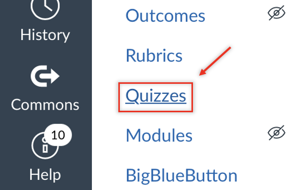{ width=45% }

2. In the top-right corner, click on **+ Quiz**.
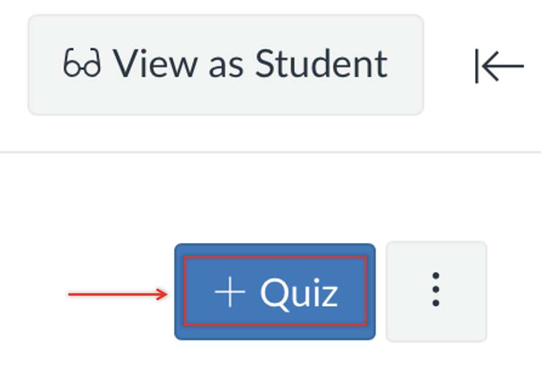{ width=45% }

3. Provide a name, instructions, and set the quiz settings as you would for any other quiz.

4. Now, click on **Questions** in the top-middle of the page.
{ width=45% }

5. Then, click on **Find Questions** located on the right side of the three options.
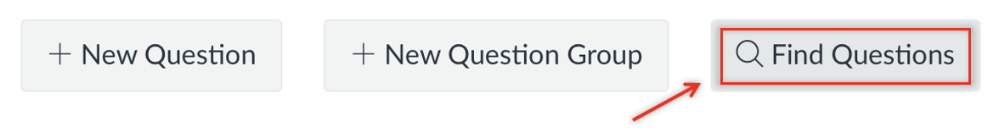{ width=80% }

6. There, you can select the question bank that we uploaded earlier.

7. Scroll down to **more questions** and click it. Repeat this process until you have loaded all the questions from the question bank.
{ width=60% }

8. Scroll up and click **Select All**, or choose the specific questions you want to use.
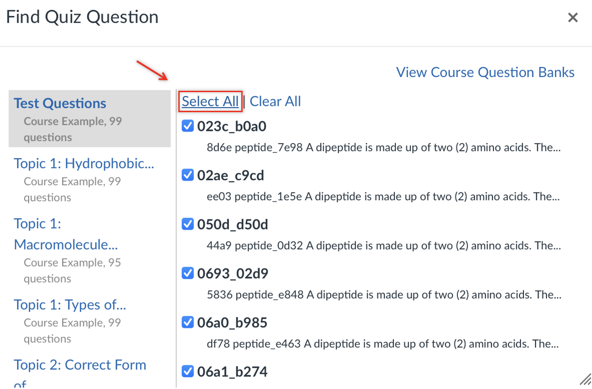{ width=60% }

9. Scroll down to where it says "**Add questions to the question group:**". Below that, you'll see a dropdown menu labeled **[ No Group ]**. Click on it and select **[ Create Group ]**.
![Canvas “Find Quiz Question” window showing selected questions and a dropdown menu with “[Create Group]” highlighted as the selected option for adding questions to a group.](canvas_how_to/Step_03_09-create_group.png){ width=60% }

10. Name the question group, select the number of questions for the quiz, and specify the points per question. Then, click **Create Group**. Finish by clicking **Add Questions**.
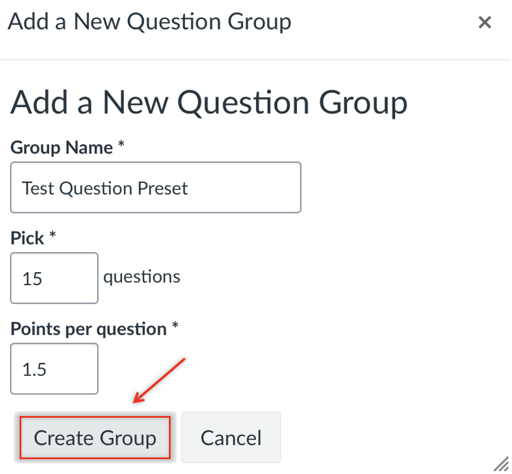{ .img-right-pad width=40% }
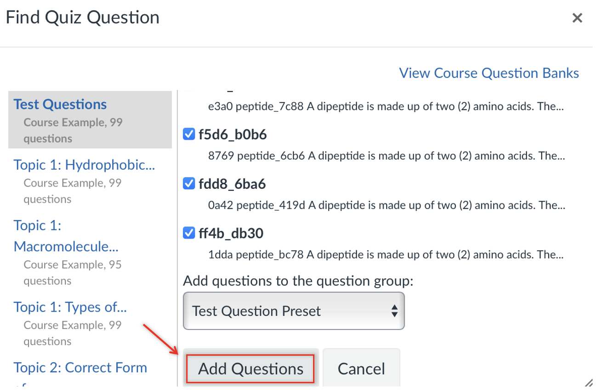{ width=54.2% }

11. Scroll to the bottom of the quiz and click **Save & Publish**, or click **Save** if you would like to publish it later.
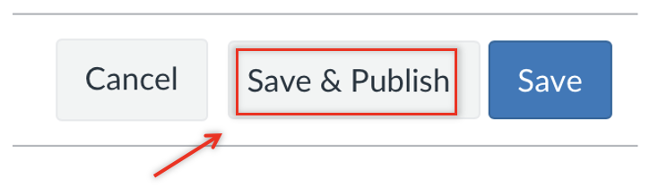{ width=70% }

---

## **Conclusion**
Congratulations! Your test is now fully set up and available for students. You have successfully:

- Uploaded the questions
- Renamed your question bank
- Created a specific randomized question preset
- Configured a test using that randomized preset

Your students can now access and complete the test within Canvas. Great job!
